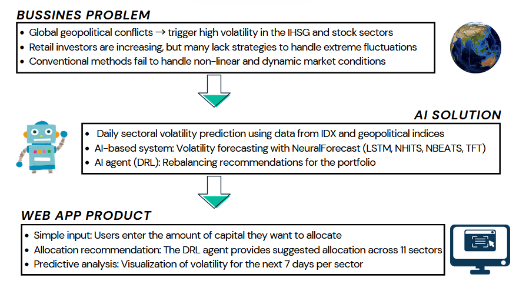
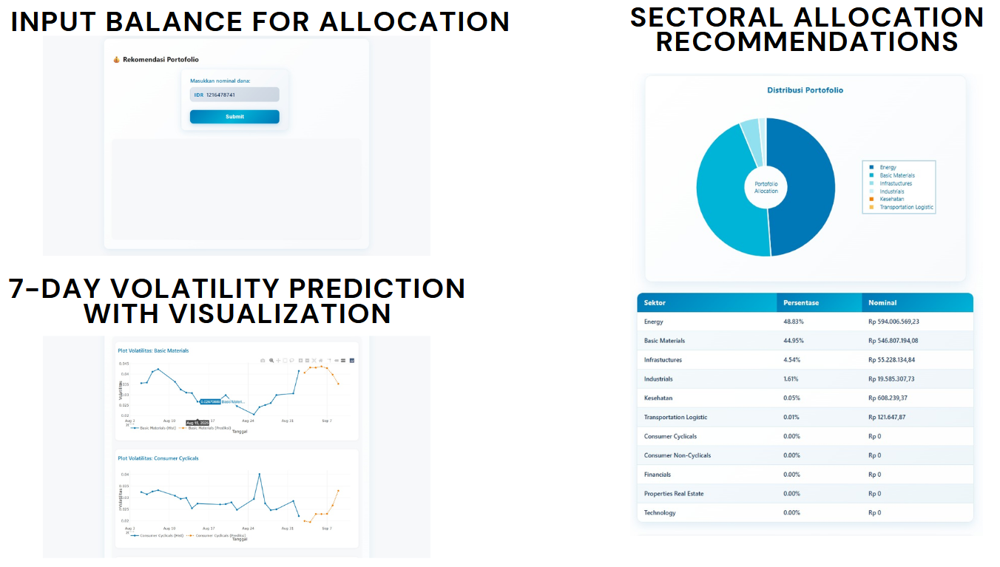
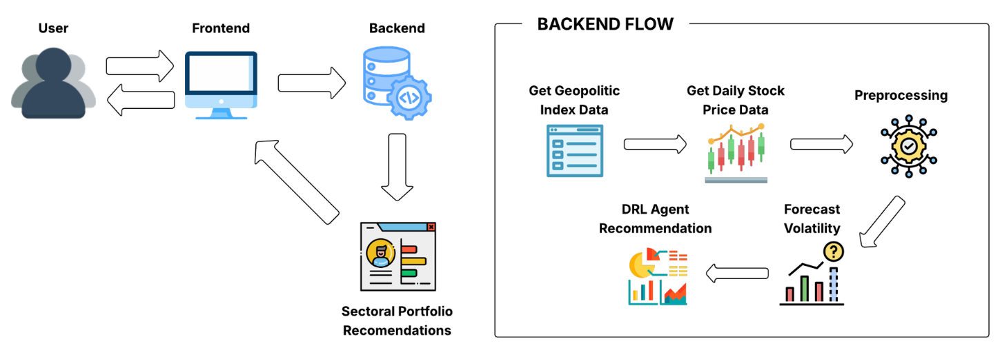
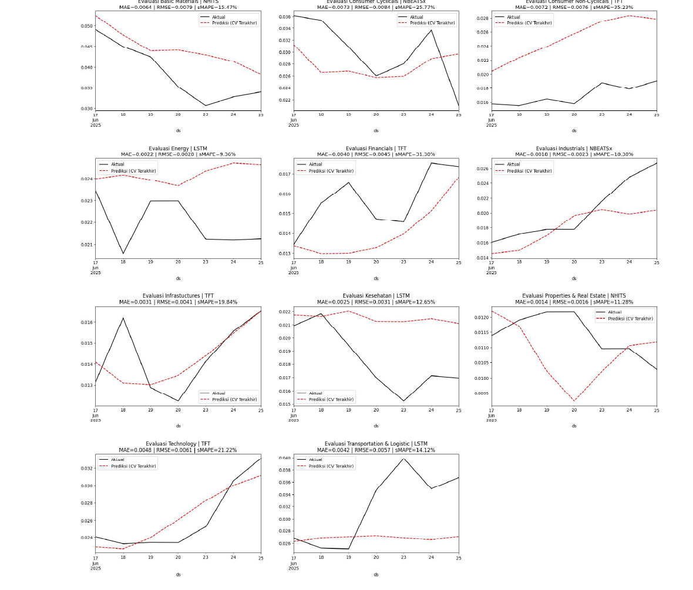
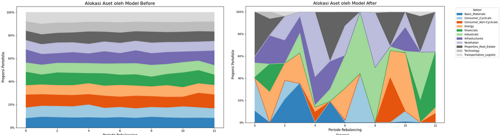
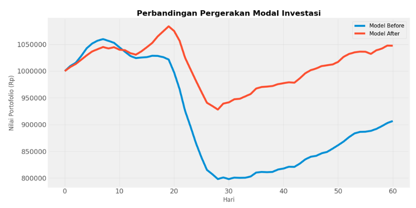

# IDX Smart Rebalance

> AI-powered sectoral portfolio recommendation system for the Indonesian stock market, built by **Tim Gacor** for **DATATHON 2025** and selected as a **Top 7 National Finalist**.



## Overview

IDX Smart Rebalance helps retail investors respond to market uncertainty by combining sector-level volatility forecasting with a Deep Reinforcement Learning (DRL) allocation agent. The system predicts 7-day volatility across 11 IDX sectors, then recommends an adaptive sectoral portfolio allocation based on the latest market and geopolitical-risk signals.

The project was developed in two stages:

- **Preliminary round:** framed the business problem, proposed the AI-based portfolio rebalancing solution, and developed the initial forecasting and DRL modeling approach.
- **Final round:** built the web dashboard/product interface and improved the modeling pipeline, especially the DRL agent and environment design, moving from a less adaptive baseline to a more expressive SAC-based policy.

## Highlights

- **Achievement:** Top 7 National Finalist, DATATHON 2025.
- **Market scope:** 11 IDX sectors.
- **Forecast horizon:** 7-day sectoral volatility prediction.
- **Forecasting models:** LSTM, TFT, N-HiTS, and N-BEATSx via NeuralForecast.
- **Allocation agent:** Soft Actor-Critic (SAC) from Stable-Baselines3.
- **Product interface:** FastAPI backend and static web frontend with allocation table, donut chart, and volatility visualization.

## Data Sources

- **IDX market data:** daily stock price data collected with `yfinance`, then aggregated into sector-level return and 7-day volatility features.
- **Geopolitical Risk Index:** daily geopolitical-risk indicators from Matteo Iacoviello's GPR dataset, which measures geopolitical tension from news coverage and provides signals such as overall risk, threat, action, and article count.

## Product Preview



The user enters an investment balance, waits for the prediction pipeline to complete, and receives:

- recommended sector allocation percentages,
- nominal allocation per sector,
- portfolio distribution visualization,
- historical and predicted volatility charts per sector.

## System Architecture



The backend pipeline combines daily sector market data, geopolitical-risk indicators, preprocessing, 7-day volatility forecasting, and the DRL recommendation agent. The frontend communicates with the backend through FastAPI endpoints and renders the recommendation output for the user.

## Core Model Development

### Forecasting

The forecasting module was designed to estimate **7-day sectoral volatility** before the allocation decision is made by the DRL agent. As part of the initial modeling work, the team evaluated combinations of sector, model family, and geopolitical/news features using NeuralForecast models. The main target was `SectorVolatility_7d`, while candidate exogenous signals included geopolitical risk components such as `GPR_Threat_Daily`, `GPR_Action_Daily`, `GPR_Daily`, and article-count features.

The first selection stage tested default model configurations across all sectors and feature scenarios, producing **220 model-sector-feature combinations**. Hyperparameter tuning was then explored with AutoModels, but the report found that selective tuning did not consistently improve performance because the dataset was relatively small and volatile. The final forecasting setup therefore prioritized the most robust sector-specific model and feature pair, validated with **5-fold time-series cross-validation**.



| Sector | Exogenous Signal | Model | Final sMAPE |
| --- | --- | --- | ---: |
| Basic Materials | GPR Threat | N-HiTS | 15.47% |
| Consumer Cyclicals | Article Count | N-BEATSx | 25.77% |
| Consumer Non-Cyclicals | GPR Threat | TFT | 35.23% |
| Energy | GPR Threat | LSTM | 9.36% |
| Financials | GPR Threat | TFT | 31.30% |
| Industrials | Article Count | N-BEATSx | 10.38% |
| Infrastructures | GPR Index | TFT | 19.84% |
| Healthcare | None | LSTM | 12.65% |
| Properties & Real Estate | GPR Threat | N-HiTS | 11.28% |
| Technology | GPR Action | TFT | 21.22% |
| Transportation & Logistic | GPR Action | LSTM | 14.12% |

Key takeaways from the initial forecasting analysis:

- `GPR_Threat_Daily` appeared most often in the best-performing sector models, suggesting that geopolitical threat intensity was an important signal for IDX sector volatility.
- TFT performed well for sectors with more complex multivariate relationships, while LSTM and N-HiTS were more effective for sectors with more stable historical patterns.
- The average final sMAPE across the selected sector models was approximately **18.15%**, which was considered reasonable for short-horizon financial time-series forecasting under volatile market conditions.
- The forecasts were not used as a standalone prediction product only; they became part of the DRL state used to recommend sector allocation.

### DRL Agent Upgrade

During the final round, the allocation agent was redesigned to make the portfolio policy more expressive and risk-aware. The preliminary version used PPO with a simpler observation design and a constrained action range, which made the recommended allocation tend to stay relatively uniform. The final version moved to a SAC-based agent with a richer state representation, explicit previous-allocation context, and a reward function that better reflected the portfolio objective.

The upgraded DRL state combines market features, predicted 7-day volatility, current return signals, relevant geopolitical/news indicators, and the previous portfolio allocation. This helps the agent avoid treating each recommendation as an isolated decision. Instead, it can consider how costly or risky it is to shift from the previous allocation to a new one.

The action space was also changed from direct allocation weights to logits in `Box(-5, 5)`, followed by softmax normalization. This gives the policy more flexibility while still ensuring that final sector weights are positive and sum to 100%.

| Aspect | Before | After |
| --- | --- | --- |
| Observation state | 43 market-only features with internal normalization | 54 features with market state, previous allocation, and external scaler |
| Action space | `Box(0, 1)` with softmax | `Box(-5, 5)` as logits, then softmax |
| Algorithm | PPO with `MlpPolicy` | SAC after multi-algorithm experimentation |
| Training steps | 20,000 | 300,000 |
| Reward design | 7-day Sharpe ratio with clipping | 7-day Sharpe ratio, switching cost, and volatility risk penalty |



The final agent became more selective and adaptive instead of spreading capital too evenly across sectors.

## Simulation Results



Rebalanced simulation over 60 days showed a stronger and more stable portfolio after the final-round optimization:

| Metric | Before | After |
| --- | ---: | ---: |
| Total return | -9.34% | +4.75% |
| Average return / rebalance | -0.0083 | 0.0064 |
| Sharpe ratio | -1.0012 | 0.7945 |
| Max drawdown | -24.7% | -14.4% |
| Simulation time | 0.15s | 0.07s |

## Tech Stack

- **Backend:** Python, FastAPI, Uvicorn
- **Data & ML:** pandas, NumPy, scikit-learn, NeuralForecast, Stable-Baselines3, Gymnasium
- **Market data:** yfinance and processed IDX sector datasets
- **Frontend:** HTML, CSS, JavaScript, Plotly, Lottie
- **Visualization:** Matplotlib and Plotly

## Repository Structure

```text
.
├── api_backend.py              # FastAPI service for prediction and status polling
├── app_streamlit.py            # Earlier Streamlit prototype
├── data/                       # Processed sector and DRL datasets
├── saved_models/               # Forecasting and DRL model artifacts
├── src/
│   ├── get_data.py             # Data collection and preprocessing
│   ├── predict.py              # Forecasting and DRL inference pipeline
│   └── train.py                # Forecasting model training workflow
└── web/                        # Static frontend
```

## Quick Start

### 1. Clone the repository

```bash
git clone https://github.com/FaarisKhairrudin/idx-smart-rebalance.git
cd idx-smart-rebalance
```

### 2. Create an environment and install dependencies

```bash
python -m venv .venv
source .venv/bin/activate  # Windows: .venv\Scripts\activate
pip install -r requirements.txt
```

### 3. Run the backend

```bash
uvicorn api_backend:app --reload --host 0.0.0.0 --port 8000
```

The backend will run at `http://localhost:8000`.

### 4. Run the frontend

Open a new terminal:

```bash
cd web
python -m http.server 8080
```

Then open `http://localhost:8080` in your browser.

## API Endpoints

| Endpoint | Method | Description |
| --- | --- | --- |
| `/predict` | GET | Starts the prediction and allocation pipeline in a background thread |
| `/predict/status` | GET | Returns the current pipeline status and prediction result |

## Future Work

- Expand recommendations from sector-level allocation to stock-level allocation.
- Add backtesting controls for different periods and capital assumptions.
- Improve experiment tracking for forecasting and DRL model comparison.
- Package the backend and frontend with Docker for simpler deployment.

## Team

**Tim Gacor, Telkom University**

- Faaris Khairudin
- Kevin Jonathan Rotty
- Arkhan Falih Fahrie Puspita

## Disclaimer

This project is for research and competition purposes only. It is not financial advice, and portfolio recommendations should be validated independently before making investment decisions.
